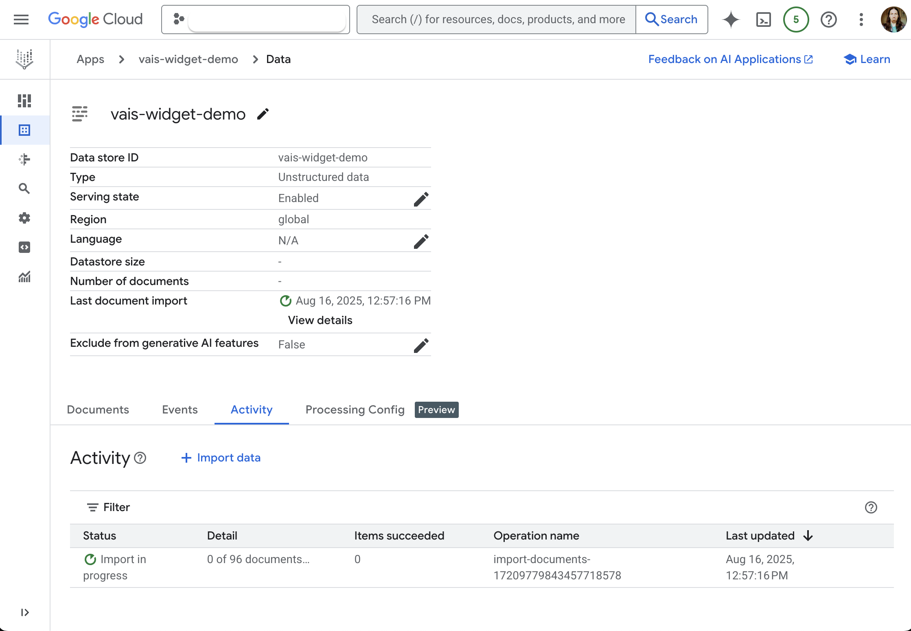

# Vertex AI Search Widget

Quickly prototype and serve a Vertex AI Search app widget on a static website hosted on Google Cloud Storage (GCS).

> [!CAUTION]
> This guide is for demonstration purposes only. It is not intended for production use and does not provide any security or access control features.

## 📋 Prerequisites

- [Terraform](https://terraform.io/downloads) >= 1.12.2
- [Google Cloud CLI](https://cloud.google.com/sdk/docs/install) with authenticated [Application Default Credentials](https://cloud.google.com/docs/authentication/set-up-adc-local-dev-environment)
- A Google Cloud project with billing enabled

## 🚀 Quick Start

### 1. Deploy Infrastructure

Clone the repository and set your project ID:

```bash
git clone <repository-url>
cd vais-widget
```

Create a `terraform.tfvars` file with your project ID:

```bash
echo 'project = "your-project-id"' > terraform.tfvars
```

Deploy the infrastructure:

```bash
terraform init
terraform plan
terraform apply
```

### 2. Import Data

Open the widget configuration page in your browser:

```bash
open -a "/Applications/Google Chrome.app" "$(terraform output -raw widget_console_page)"
```

Or manually navigate to: **AI Applications** → **[Your App]** → **Integration** → **Widget**

1. Click **Import Data**


2. Select **Cloud Storage**
3. select folder: `cloud-samples-data/gen-app-builder/search/alphabet-investor-pdfs`
4. Choose **Unstructured documents**
5. Click **Import**


6. Monitor the import status in the console



### 3. Configure the Widget

1. Navigate to: **AI Applications** → **[Your App]** → **Integration** → **Widget**
2. Select **Public Access**
3. Add these allowed domains:
   - `storage.googleapis.com` → **Add**
   - `localhost` → **Add**
   - Click **Save**


4. Copy the `configId` value from the widget code and paste it within double quotes in the `index.html` file element `<gen-search-widget>` attribute `configId` value (replace the "replace-with-your-configId-value")


Before:
```html
...
    <!-- Search widget element is not visible by default -->
    <gen-search-widget
        configId="replace-with-your-configId-value"
        triggerId="searchWidgetTrigger">
    </gen-search-widget>
...

```

After:
```html
...
    <!-- Search widget element is not visible by default -->
    <gen-search-widget
        configId="d665d1bf-d8c4-4080-bbff-41b894b6f2ec"
        triggerId="searchWidgetTrigger">
    </gen-search-widget>
...

```

5. Navigate to **Configurations** → **UI** to configure additional widget attributes

For example: configure Search with an answer (generative answers)


6. Test configurations and click **Save and publish** to apply changes

### 4. Upload and Access the Widget

Upload the widget to your bucket:

```bash
gcloud storage cp index.html "$(terraform output -raw upload_uri)"
```

Open the deployed widget:

```bash
open -a "/Applications/Google Chrome.app" "$(terraform output -raw site_link)"
```

> [!NOTE]
> Domain allowlist changes can take ~30 minutes to propagate

### 5. Clean Up

When finished testing:

```bash
terraform destroy
```

## 🏗️ What Gets Created

The Terraform configuration creates:

- **API Services**: Enables required Google Cloud APIs via `google_project_service` resources
- **Storage**: Creates a public GCS bucket with managed folder for hosting the HTML widget  
- **Vertex AI Search**: Provisions empty data stores and search engines (data import is done manually)

All Terraform resources are defined in a single `main.tf` file in the root directory for simplicity.

## ⚙️ Additional Configuration

You can customize the deployment by editing variables in `terraform.tfvars`. See `variables.tf` for available options.

For detailed manual setup instructions, see [`docs/manual_steps.md`](docs/manual_steps.md).

<br>

## 📚 References

### Search App and Data Store
- [About apps and data stores](https://cloud.google.com/generative-ai-app-builder/docs/create-datastore-ingest)
- [Custom search checklist](https://cloud.google.com/generative-ai-app-builder/docs/generic-search-checklist)
- [Get started with custom search](https://cloud.google.com/generative-ai-app-builder/docs/try-enterprise-search#unstructured-data)
- [Create a search app](https://cloud.google.com/generative-ai-app-builder/docs/create-engine-es)
- [Create a search data store | Import from Cloud Storage](https://cloud.google.com/generative-ai-app-builder/docs/create-data-store-es#cloud-storage)
- [Parse and chunk documents](https://cloud.google.com/generative-ai-app-builder/docs/parse-chunk-documents)
- [Get search results](https://cloud.google.com/generative-ai-app-builder/docs/preview-search-results)
- [Get answers and follow-ups](https://cloud.google.com/generative-ai-app-builder/docs/answer)

### Widget Configuration
- [Add the search widget to a web page](https://cloud.google.com/generative-ai-app-builder/docs/add-widget)
- [Configure results for the search widget](https://cloud.google.com/generative-ai-app-builder/docs/configure-widget-attributes)
- [Public access problem in Gen App Builder integration](https://stackoverflow.com/questions/76975273/public-access-problem-in-gen-app-builder-integration)
